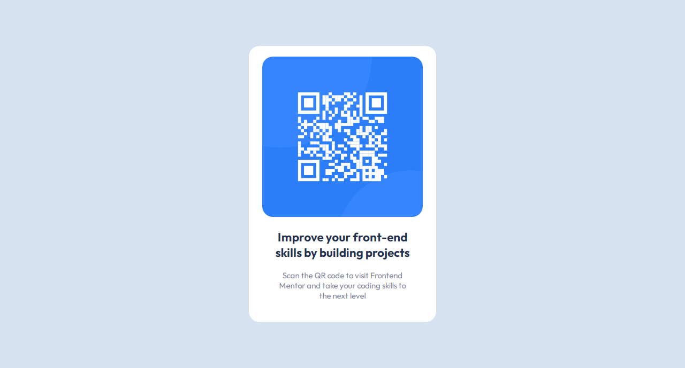

# Frontend Mentor - QR code component solution

This is a solution to the [QR code component challenge on Frontend Mentor](https://www.frontendmentor.io/challenges/qr-code-component-iux_sIO_H). Frontend Mentor challenges help you improve your coding skills by building realistic projects. 

## Table of contents

- [Overview](#overview)
  - [Screenshot](#screenshot)
  - [Links](#links)
- [My process](#my-process)
  - [Built with](#built-with)
  - [What I learned](#what-i-learned)
- [Author](#author)
- [Acknowledgments](#acknowledgments)

**Note: Delete this note and update the table of contents based on what sections you keep.**

## Overview

### Screenshot

### Links

- Solution URL: [Visit](https://github.com/zikoechetabu/qrcode)
- Live Site URL: [Visit](https://zikkyqrcode.vercel.app)

## My process

### Built with

- Semantic HTML5 markup
- CSS custom properties
- Flexbox

### What I learned

I learnt more markups on HTML and more styles on CSS.

## Author

- Website - [Zikora Echetabu](https://www.your-site.com)
- Frontend Mentor - [@zikoechetabu](https://www.frontendmentor.io/profile/zikoechetabu)

## Acknowledgments

I want to thank Frontend Mentor and also
- My Mentor - [LeXiZ](https://twitter.com/lexiz_uchenna_)